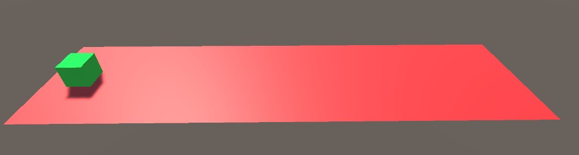
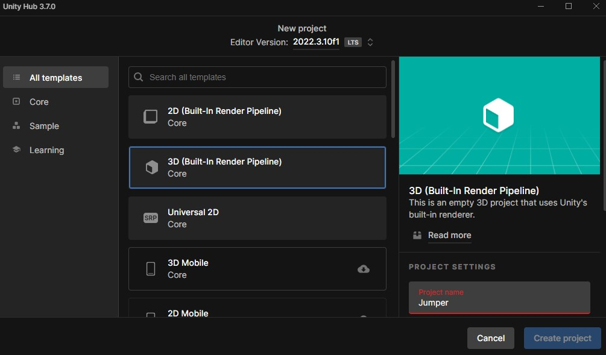
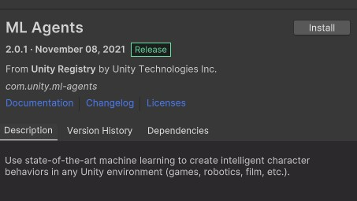
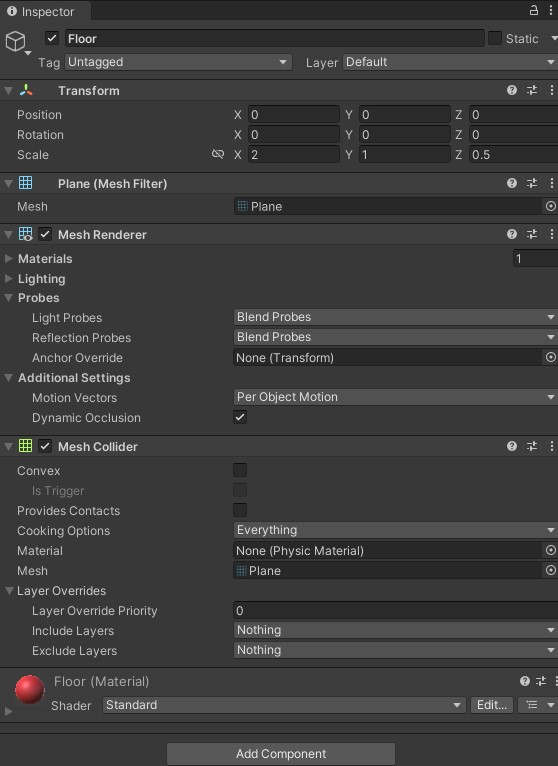
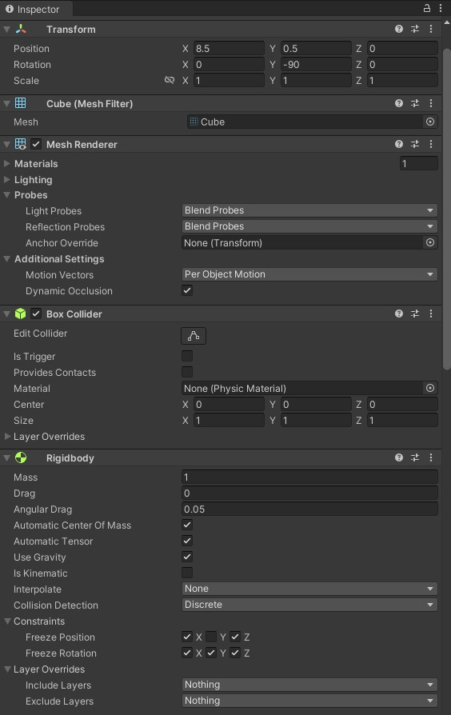
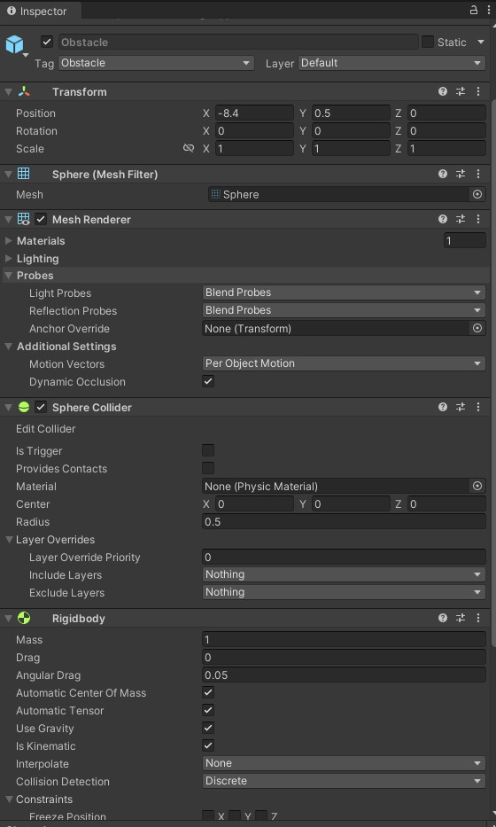
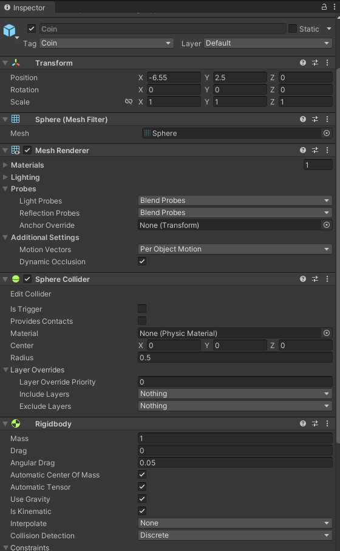
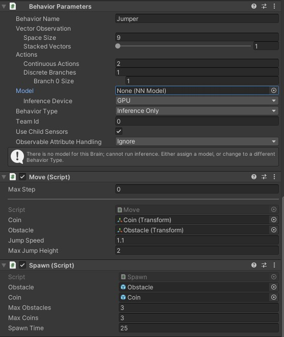
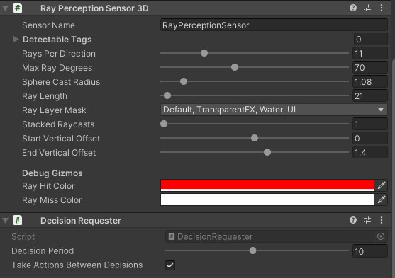

# Jumper Assignment 

In this assignment we have an agent who continously avoids obstacles (with different speeds) and collects coins.
Disclaimer: I could not push the project to github because of bandwith problems instead I uploaded it on onedrive: https://apbe-my.sharepoint.com/:f:/g/personal/s127748_ap_be/EtAEucOTY0hOm6xTYG6M3W4BHXZ1xWQgN6wAYdRov2sryQ?e=lN6MUD


## Overview

Using the ML-Agents Toolkit in a Unity project involves the following basic steps:

1. Create an environment for your agents to live in. An environment can range from a simple physical simulation containing a few objects to an entire game or ecosystem.

2. Implement your Agent subclasses. An Agent subclass defines the code an Agent uses to observe its environment, to carry out assigned actions, and to calculate the rewards used for reinforcement training. 

3. Add your Agent subclasses to appropriate GameObjects, typically, the object in the scene that represents the Agent in the simulation.

## Set Up the Unity Project

The first task to accomplish is simply creating a new Unity project and importing the ML-Agents asset into it:

1. Choose "3D Built-In Render Pipeline" and name the Project "Jumper".



2. From the upper navigation go to "Window" and select "Package Manager"
Select from packages "Unity Registry" and scroll down to find the "ML Agents" package to install it.



## Create the Environment

Next, we will create a simple environment for our agent. 
The following objects are included in our environment:

1. Plane as the "Floor"
2. Cube as the "Agent"
3. Sphere as the "Obstacle"
4. Another sphere as a "Coin"

### Create the Floor Plane

1. Right click in Hierarchy window, select 3D Object > Plane.
2. Name the GameObject "Floor".
3. Select the Floor Plane to view its properties in the Inspector window.
4. Set the properties like shown in the image below



### Create the Cube Agent

1. Right click in Hierarchy window, select 3D Object > Cube.
2. Name the GameObject "Agent".
3. Select the Cube Agent to view its properties in the Inspector window.
4. Set the properties like shown in the image below



### Create the Sphere Obstacle

1. Right click in Hierarchy window, select 3D Object > Sphere.
2. Name the GameObject "Obstacle".
3. Add a tag to it named "Obstacle"
3. Select the Obstacle  to view its properties in the Inspector window.
4. Set the properties like shown in the image below
5. Add it to your assets to make it a prefab and delete the one in your scene



### Create the Sphere Obstacle

1. Right click in Hierarchy window, select 3D Object > Sphere.
2. Name the GameObject "Coin".
3. Add a tag to it named "Coin"
3. Select the Coin to view its properties in the Inspector window.
4. Set the properties like shown in the image below
5. Add it to your assets to make it a prefab and delete the one in your scene



## Scripts

We need 3 scripts:
1. Move
2. Spawn
3. Destroy

### Move

This is the main script for your agent.

```
using System.Collections;
using System.Collections.Generic;
using Unity.MLAgents;
using Unity.MLAgents.Sensors;
using Unity.MLAgents.Actuators;
using UnityEngine; 
```

These are the modules you need to include in your script.


```
public class Move : Agent
{
    public Transform coin;
    public Transform obstacle;

    public float jumpSpeed = 1.1f;
    public float maxJumpHeight = 2f;

    public override void OnEpisodeBegin()
    {
        this.transform.localPosition = new Vector3(8.5f, 0.5f, 0);
        this.transform.rotation = Quaternion.Euler(0, -90, 0);
    }

    public override void CollectObservations(VectorSensor sensor)
    {
        sensor.AddObservation(this.transform.localPosition);
        sensor.AddObservation(coin.localPosition);
        sensor.AddObservation(obstacle.localPosition);
    }
```
This is the beginning of your script. We create a class AgentMovement, it has a few properties: your coin and your obstacle and some jump parameters.

OnEpisodeBegin we set the cube's position and rotation corrrectly.

CollectObservations is used to feed data in to the neural network. We currently give the positions of itself, the coin and the obstacle.

```
public override void OnActionReceived(ActionBuffers actions)
    {
        Vector3 controlSignal = Vector3.zero;

        float jumpHeight = actions.ContinuousActions[0] * maxJumpHeight;
        if (jumpHeight > 0 && transform.position.y >= maxJumpHeight)
        {
            jumpHeight = 0;
        }

        controlSignal.y = jumpHeight;

        this.transform.Translate(controlSignal * jumpSpeed);

        AddReward(0.001f);

        if (this.transform.localPosition.y < 0)
        {
            EndEpisode();
        }

        // If agent jumps over obstacle
        if (obstacle.transform.localPosition.x > 15)
        {
            AddReward(0.5f);
        }
    }
```
OnActionReceived is responsible for the jumping and reward part.

We first script our jump and then add a tiny reward, if it jumps over the obstacle it gets rewarded. The episode ends when he goes under the floor.

``` 
void OnCollisionEnter(Collision collision)
    {
        if (collision.gameObject.CompareTag("Obstacle"))
        {
            AddReward(-1f);

            // Destroy all obstacles and coins
            GameObject[] obstacles = GameObject.FindGameObjectsWithTag("Obstacle");
            foreach (GameObject obstacle in obstacles)
            {
                Destroy(obstacle);
            }
            GameObject[] coins = GameObject.FindGameObjectsWithTag("Coin");
            foreach (GameObject coin in coins)
            {
                Destroy(coin);
            }

            EndEpisode();
        }

        if (collision.gameObject.CompareTag("Coin"))
        {
            AddReward(1f);
            Destroy(collision.gameObject);
        }
    }
```

This is where we detect the collision and destroy objects. If the agent collides with an obstacle it gets a big negative reward and it ends the episode while destroying every coin and obstacle. It gets a big positive reward if it collects a coin by colliding with it.


```   
public override void Heuristic(in ActionBuffers actionsOut)
    {
        var continuousActionsOut = actionsOut.ContinuousActions;
        continuousActionsOut[0] = Input.GetAxis("Vertical");
    }
```
We use this to manually play the game.

## Spawn and Destroy

These scripts are responsible for spawning the prefabs and giving them velocity, also destroying them if the obstacle gets past a point.

The spawn script:

```
using System.Collections;
using System.Collections.Generic;
using UnityEngine;

public class Spawn : MonoBehaviour
{
    public GameObject obstacle;
    public GameObject coin;
    public int maxObstacles = 3;  
    public int maxCoins = 3;      
    public float spawnTime = 25f;
    private float counter = 0f;

    private void Spawner()
    {
        int numObstacles = GameObject.FindGameObjectsWithTag("Obstacle").Length;
        int numCoins = GameObject.FindGameObjectsWithTag("Coin").Length;

        if (numObstacles < maxObstacles && numCoins < maxCoins)
        {
            int random = Random.Range(0, 6);
            if (random > 2)
            {
                GameObject a = Instantiate(obstacle);
                a.tag = "Obstacle";
                a.transform.localPosition = new Vector3(-8.4f, 0.5f, 0f);
            }
            else
            {
                GameObject b = Instantiate(coin);
                b.tag = "Coin";
                b.transform.localPosition = new Vector3(-6.55f, 2.5f, 0f);
            }
        }
    }

    void Update()
    {
        if (counter <= 0)
        {
            counter = spawnTime;
            Spawner();
        }
        counter -= Time.deltaTime;
    }
}
```

The Destroy script:

```
using System.Collections;
using System.Collections.Generic;
using UnityEngine;

public class Destroy : MonoBehaviour
{
    private Rigidbody rb;
    private float speed;
    public void Start()
    {
        rb = this.GetComponent<Rigidbody>();
        speed = Random.Range(-0.1f, -0.15f);
    }

    public void Update()
    {
        this.transform.Translate(-speed, 0, 0);
        if (this.transform.localPosition.x > 15) 
        {
            Destroy(this.gameObject);
        }
    }
}
```

## Final Setup

We add these properties to our agent to set it up to train



We also add a ray perception sensor to detect incoming objects.



## Testing the Environment

The config file you should you to train goes as follows:

```
behaviors:
  Jumper:
    trainer_type: ppo
    hyperparameters:
      batch_size: 10
      buffer_size: 100
      learning_rate: 3.0e-4
      beta: 5.0e-4
      epsilon: 0.2
      lambd: 0.99
      num_epoch: 3
      learning_rate_schedule: linear
      beta_schedule: constant
      epsilon_schedule: linear
    network_settings:
      normalize: false
      hidden_units: 128
      num_layers: 2
    reward_signals:
      extrinsic:
        gamma: 0.99
        strength: 1.0
    max_steps: 500000
    time_horizon: 64
    summary_freq: 10000
```

To train the agent we can use anaconda terminal and enter the following command:
```mlagents-learn config/jumper.yaml --run-id=Jumper```

To monitor the statistics of Agent performance during training, use TensorBoard. You can do this by opening another anaconda terminal and pasting this command:

```tensorboard --logdir results --port 6006```
